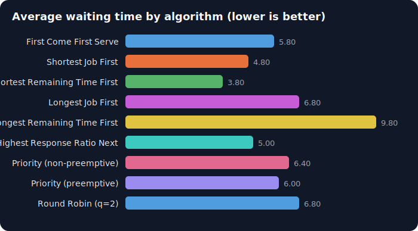
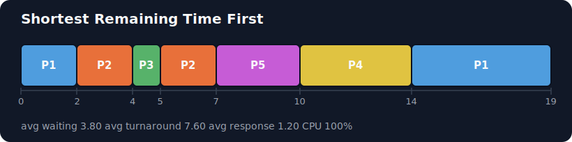
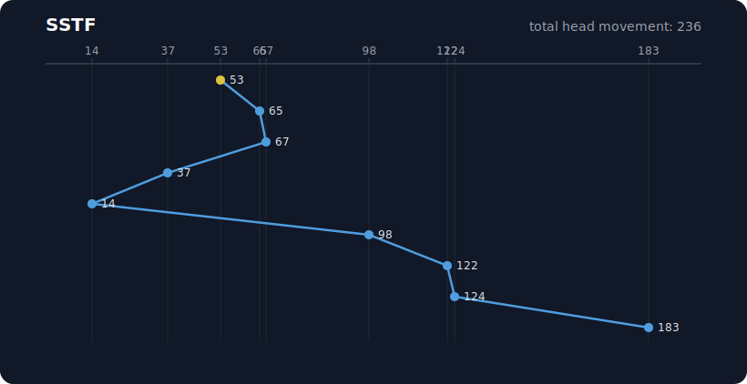
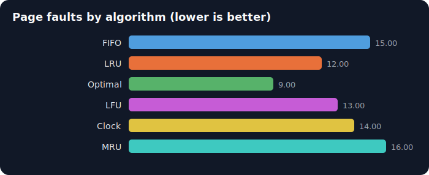
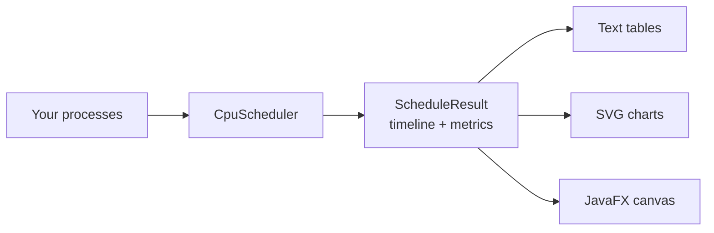

# OS Scheduler Studio

A desktop app and command line tool that simulates and draws the classic operating system scheduling algorithms. Type in some processes, pick an algorithm, and watch the Gantt chart, the metrics table and the averages appear. It covers CPU scheduling, disk scheduling and page replacement, so it is one place to learn the whole scheduling side of an operating systems course.


> The pictures in this file are real SVG charts produced by the program itself. Run `mvn -q package -DskipTests` then `java -jar target/os-scheduler-studio.jar demo` and they are regenerated into `docs/images`.

---

## Table of contents

- [What it does](#what-it-does)
- [Algorithms covered](#algorithms-covered)
- [A look at the output](#a-look-at-the-output)
- [Getting started, the short version](#getting-started-the-short-version)
- [Getting started, step by step for a first timer](#getting-started-step-by-step-for-a-first-timer)
- [Using the command line tool](#using-the-command-line-tool)
- [How the project is organised](#how-the-project-is-organised)
- [How it works under the hood](#how-it-works-under-the-hood)
- [Running the tests](#running-the-tests)
- [Adding your own algorithm](#adding-your-own-algorithm)
- [Learn the whole project from scratch](#learn-the-whole-project-from-scratch)
- [Credits and license](#credits-and-license)

---

## What it does

- Runs 9 CPU scheduling algorithms, 6 disk scheduling algorithms and 6 page replacement algorithms.
- Draws a Gantt chart for CPU runs, a seek graph for disk runs, and a frame by frame table for page runs.
- Reports every number a course cares about: completion time, turnaround time, waiting time, response time, CPU utilisation, throughput, total head movement, page faults and hit ratio.
- Has a "compare all" mode that runs every CPU algorithm on the same input and charts their average waiting times side by side.
- Ships with a command line tool as well as the window, so you can script it or drop it into a report.
- Exports charts as SVG images with the `--svg` option (CPU, disk and page), and the `demo` command writes a full set into `docs/images`.
- Is covered by 35 automated tests that check the algorithms against known textbook results.

## Algorithms covered

### CPU scheduling

| Key | Name | Preemptive | Notes |
| --- | --- | --- | --- |
| `fcfs` | First Come First Serve | no | Runs jobs in arrival order. |
| `sjf` | Shortest Job First | no | Picks the shortest ready job. |
| `srtf` | Shortest Remaining Time First | yes | The preemptive version of SJF. |
| `ljf` | Longest Job First | no | The opposite of SJF, useful as a contrast. |
| `lrtf` | Longest Remaining Time First | yes | The preemptive version of LJF. |
| `hrrn` | Highest Response Ratio Next | no | Balances short jobs against waiting time. |
| `priority` | Priority | no | Smaller priority number means more important. |
| `priority-p` | Priority | yes | Preemptive priority. |
| `rr` | Round Robin | yes | Fair time slices set by a quantum. |

### Disk scheduling

| Key | Name | Notes |
| --- | --- | --- |
| `fcfs` | First Come First Serve | Serves requests in the order they arrived. |
| `sstf` | Shortest Seek Time First | Always jumps to the nearest request. |
| `scan` | SCAN (elevator) | Sweeps to the end of the disk, then reverses. |
| `cscan` | C-SCAN | Sweeps one way, jumps back, sweeps again. |
| `look` | LOOK | Like SCAN, but turns around at the last request. |
| `clook` | C-LOOK | Like C-SCAN, but wraps at the last request. |

### Page replacement

| Key | Name | Notes |
| --- | --- | --- |
| `fifo` | FIFO | Evicts the page that has been in memory longest. |
| `lru` | LRU | Evicts the page unused for the longest time. |
| `optimal` | Optimal | Evicts the page needed farthest in the future. |
| `lfu` | LFU | Evicts the least frequently used page. |
| `clock` | Clock (Second Chance) | The practical approximation of LRU. |
| `mru` | MRU | Evicts the most recently used page. |

## A look at the output

Comparing every CPU algorithm on the same five processes. Shorter bars are better.



A Gantt chart for Shortest Remaining Time First. You can see the CPU switching between processes as shorter jobs arrive.



A disk seek graph for Shortest Seek Time First, starting at cylinder 53.



Page faults for the standard reference string with three frames. Optimal is the best any algorithm can ever do.



## Getting started, the short version

You need Java 21 and Maven. Then:

```bash
# open the desktop app
mvn -q javafx:run

# or use the command line tool
mvn -q package -DskipTests
java -jar target/os-scheduler-studio.jar demo
```

If you have never used Java or Maven before, follow the longer guide next.

## Getting started, step by step for a first timer

This section assumes you have never built a Java project. Take it one line at a time.

**1. Install Java 21.**

Download a Java 21 build from [Adoptium](https://adoptium.net/) and install it. To check it worked, open a terminal and run:

```bash
java -version
```

You should see a version that starts with `21`. If you see a lower number or an error, the install did not finish.

**2. Install Maven.**

Maven is the tool that downloads the libraries and builds the code, so you do not have to do any of that by hand.

- On macOS with Homebrew: `brew install maven`
- On Windows with Chocolatey: `choco install maven`
- On Linux with apt: `sudo apt install maven`

Check it with:

```bash
mvn -version
```

**3. Get the code and move into the folder.**

```bash
cd os-scheduler-studio
```

**4. Open the desktop app.**

```bash
mvn javafx:run
```

The first run takes a minute because Maven downloads JavaFX. After that a window opens with three tabs. Try the CPU tab: it already has sample processes filled in, so just click **Run** and the Gantt chart appears. Click **Compare all** to see every algorithm ranked.

**5. Try the command line tool instead (optional).**

```bash
mvn package -DskipTests
java -jar target/os-scheduler-studio.jar demo
```

This prints a full report for every algorithm and writes the SVG charts into `docs/images`.

That is it. You are running an operating systems simulator.

## Using the command line tool

The tool has a few commands. Run it with no command to see the help.

```bash
# list every algorithm and its key
java -jar target/os-scheduler-studio.jar list

# one CPU algorithm; a process is id,arrival,burst with an optional priority
java -jar target/os-scheduler-studio.jar cpu rr \
    --processes "P1,0,5; P2,1,3; P3,2,1" --quantum 2

# save the Gantt chart as an image at the same time
java -jar target/os-scheduler-studio.jar cpu srtf \
    --processes "P1,0,7; P2,2,4; P3,4,1" --svg my-chart.svg

# one disk algorithm
java -jar target/os-scheduler-studio.jar disk sstf \
    --head 53 --requests "98,183,37,122,14,124,65,67"

# one page replacement algorithm
java -jar target/os-scheduler-studio.jar page lru \
    --frames 3 --refs "7 0 1 2 0 3 0 4 2 3 0 3 2"

# run everything on the built in samples and regenerate the charts
java -jar target/os-scheduler-studio.jar demo
```

## How the project is organised

```
os-scheduler-studio/
├── pom.xml                     Maven build file (dependencies and commands)
├── README.md                   this file
├── docs/
│   ├── project-explained.html  a full walkthrough for beginners
│   └── images/                 SVG charts produced by the demo
└── src/
    ├── main/java/com/osscheduler/
    │   ├── Main.java            the single entry point
    │   ├── core/               the algorithms, with no user interface code
    │   │   ├── model/          plain data types (CpuProcess, ScheduleResult, ...)
    │   │   ├── cpu/            the CPU scheduling algorithms
    │   │   ├── disk/           the disk scheduling algorithms
    │   │   └── page/           the page replacement algorithms
    │   ├── viz/                turns results into text tables and SVG images
    │   ├── cli/                the command line tool
    │   └── ui/                 the JavaFX desktop app
    ├── main/resources/
    │   └── theme.css           the dark theme for the desktop app
    └── test/java/              the automated tests
```

The most important idea is the split between `core` and everything else. The `core` package knows how to schedule, but it knows nothing about windows, colours or the command line. The `viz`, `cli` and `ui` packages sit on top of it. That means the same algorithm code powers the desktop app, the command line tool and the tests, with no duplication.

## How it works under the hood

Every CPU algorithm returns the same shape of result, described by a small interface:

```java
public interface CpuScheduler {
    String name();
    ScheduleResult schedule(List<CpuProcess> processes);
}
```

Because they all speak this one language, the rest of the app never needs a special case. The disk and page algorithms follow the same idea with their own interfaces.

The algorithms themselves share as much as possible:

- The non preemptive CPU algorithms (FCFS, SJF, LJF, HRRN, priority) only differ in which ready process they pick, so they all extend one base class and implement a single `select` method.
- The preemptive ones (SRTF, LRTF, preemptive priority) advance the clock one unit at a time and only differ in a single `pick` method.
- Round Robin is the odd one out and has its own implementation, because it cares about queue order rather than a "best right now" rule.



If you want the full story, including the challenges and how each one was solved, read the beginner walkthrough in `docs/project-explained.html`. Open it in any web browser.

## Running the tests

```bash
mvn test
```

The tests check the algorithms against results that are worked out by hand or taken from standard textbook examples. For instance, the disk tests use the well known request queue starting at cylinder 53 and confirm the total head movement for each algorithm (640 for FCFS, 236 for SSTF, and so on). The page tests confirm the classic fault counts (15 for FIFO, 12 for LRU, 9 for Optimal). There are also invariant tests that must hold for every schedule, such as turnaround time always equalling waiting time plus burst time.

## Adding your own algorithm

Say you want to add a new CPU algorithm. The steps are small:

1. Create a class in `core/cpu` that implements `CpuScheduler`, or extends `AbstractNonPreemptiveScheduler` if it never interrupts a running job.
2. Add one line to the `CpuAlgorithm` enum with a key and a display name.
3. That is all. The command line tool and the desktop app pick it up automatically, because both read the list of algorithms from that enum.

## Learn the whole project from scratch

If you are new to all of this and want to be able to explain the project confidently, open `docs/project-explained.html` in a browser. It starts from the smallest building block, a single process, and builds up to the whole app, explaining the approach, the steps that were followed, the problems that came up and how each was solved.

## Credits and license

Built by Yogi Makadiya. Released under the MIT License, so you are free to use, change and share it. See the [LICENSE](LICENSE) file for the details.
